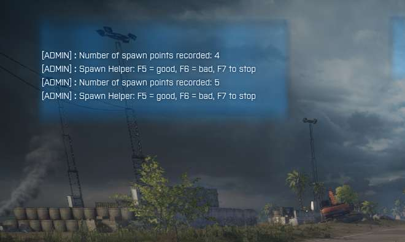
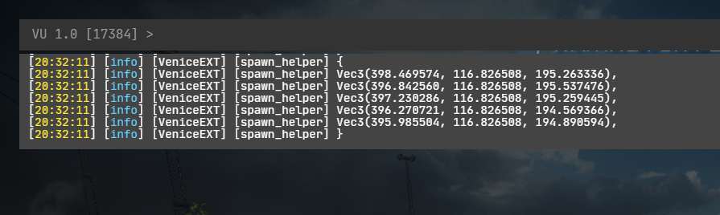

# Spawn Helper

This mod helps with placing spawn points

## Usage

- Move to the center of your new spawn area
- Set the desired max radius of your spawn points using the console command `spawn_helper.radius`
- Press F4 to start; The player will be moved to a new position
    - F5 = add current player pos to the spawn points list + move to a new pos
    - F6 = disregard current pos + move to a new pos
    - F7 = stop the process and print all recorded spawn points to the console

## Screenshots

